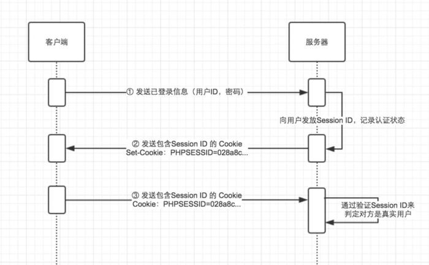

# record 


## C/C++ point
1. strlen根据第一个"\0"来判断长度；

1. strstr（a, b）判断a中是否包含b，不能忽略大小写；

1. strcasecmp(a,b) a是否等于b，忽略大小写；

1. linux 程序内存泄露测试工具

        valgrind

1. 网站压力测试工具

<https://github.com/EZLippi/WebBench.git>


## 动态接口的实现

1. 建立一个路由map，这个由controller开发者将自己的controller添加进去;

    ```c++
    void registController()
    {
        strControllerMap["/a"] = &aController;
        strControllerMap["/b"] = &bController;
    }
    ```
1. 根据url匹配map调用对应方法
    ```c++
    int Dispatcher::url2Controller(std::string url, HttpRes &httpRes)
    {
        if (strControllerMap.count(url))
        {
            std::string content = (*strControllerMap[url])(url);
            httpRes.setCLen(content.size());
            httpRes.setContent((unsigned char *) content.c_str());
            return 0;
        }
        return 1;
    }
    ```
1. 请求参数问题，封装一个mnRequest类，提供类似java的request.getparameter()方法：

    由于拿到的包含参数的url是字符串类型，mnRequest存储参数的map都存为string类型。
    controller开发者拿到对应参数，如果不是string类型，需要自己（调用strUtil）转换类型。


## 数据库连接池实现

基于多线程技术实现，mysql连接数设为1000,框架连接800报错，大概是受内存大小影响，400可以通过，初始化时间较长。

1. 资源池作为全局变量;
1. 连接信息不需要作为对象属性维护;
1. 以m为单位，超过n*m 自动增加m，低于(n-1)*m自动释放m;

        打算在getCon和relaeaseCon的时候检查触发，但是这里也会有并发，需要加锁！！！
1. 配置项添加最小连接数也就是m，最大连接数M;

        新版本实现后500线程没有问题，减少许多浪费。
1. 连接较多时循环查找浪费时间：

        在用资源和未用资源分池处理。

        每个线程线程取得连接之后将该连接从资源池拿出，可能多个线程同时取一个连接，需要加锁！！

数据库连接在一段时间没有活动之后，mysql会关闭连接
需要判断失效的链接点，并移除

http://blog.csdn.net/jmh1996/article/details/70479815
## 请求分发模型

放弃多进程，使用epool + 多线程模型

[介绍](http://blog.csdn.net/ljx0305/article/details/4065058)

[原理](http://blog.csdn.net/xiejiashu/article/details/16859747)
[内部原理](http://blog.csdn.net/shenya1314/article/details/73691088)

官方介绍： man epoll

1. Three main methord

```C++
epoll_create()
epoll_ctl()
epoll_wait()
```

1. Two triggered method

Level-triggred and Edge-triggered

linux 一个线程默认8096, windows 默认1M;

epoll+线程池 基本实现，但是阻塞很大，还不熟悉epoll的细节
尝试单用epoll一样阻塞，排除多线程的问题。

## POST PUT DELETE

1. GET

    请求资源；

1. POST

    提交信息；

    a. HttpRep 类里边如果有content解析内容到content属性；
    b. Dispatcher 类增加content属性；
    c. mnRequest 类解析content内容；


1. PUT

    更改资源；

1. DELETE

    删除资源；

1. HEAD

    只返回资源的头部，不返回内容；

1. TRACE
    
    返回接收到的请求体，用于确认追踪；

1. OPTIONS

    决定可以在服务器上执行哪些方法；

## Update HttpReq

1. 根据符号分割：

a. 去除首尾的 '\r','\n' 或 '\r\n'；
b. '\r','\n' 或 '\r\n' 分割行；
c. 去除每一行的 '\r','\n' 或 '\r\n'；

1. 使用map存储普通属性，特殊属性作为对象属性存储（）；

a. 首行作为特殊属性存储；
b. 如果Content-length 为0 或者没有Content-length 属性则没有content

## Update mnRequest 
1. 多重构造方法

**********************************************************************
2018/03/12

## C++ 项目源文件组织规则思考

新的架构进行中，需要确定框架提供给用户的最终形态，并保持相对独立；

1. 全局只包括 类和namespace包含的函数，用户只需要引入一个文件就可以使用整个框架

1. 用户可以直接访问namespace包含的所有函数，但是类不直接提供；

1. mysql connector 暂时默认属于框架内部，json暂时不属于；

1. .cpp 和 .h 文件一起时，对于其他文件的引用和系统文件的引用应该放到 .cpp文件 这样能防止引用这个模块的重复引用；

**********************************************************************
2018/03/20

## 尝试实现一个session：

Session原理：

<https://www.jianshu.com/p/2b7c10291aad>



1. 客户端把用户 ID 和密码等登录信息放入报文的实体部分，通常是以 POST 方法把请求发送给服务器。

1. 服务器会发放用以识别用户的 Session ID。通过验证从客户端发送过来的登录信息进行身份验证，然后把用户的认证状态与 Session ID 绑定后记录在服务器端。向客户端返回响应时，会在首部字段 Set-Cookie 内写入 Session ID。

1. 客户端接收到从服务器端发来的 Session ID 后，会将其作为 Cookie 保存在本地。下次向服务器发送请求时，浏览器会自动发送 Cookie，所以 Session ID 也随之发送到服务器。服务器端可通过验证接收到的 Session ID 识别用户和其认证状态。

Session 实现步骤：

1. 用户名+时间 加密形成字符串；
1. 字符串 + 有效时间 存储
1. 时间较短的存入内存；
1. 时间较长的存入文件；
1. session启动的情况，每次请求校验cookie中的sessionid是否在session中。
1. 当总量较多或者固定每段时间调用方法清理过期session

使用hash实现sessionid存储；
<https://www.biaodianfu.com/blizzard-hash.html>

***********************************************************************************************
周末完善前段：

1. 登录成功设置cookie；
1. 如果检测到cookie就不显示Sin in | up, 显示用户名前几个字母；
    登录成功隐藏登录层， 移除login_btn元素，添加下拉元素；
1. 下拉显示新建博客，管理博客（暂时空链接），登出；
1. 登出删除相应cookie；
1. 新建博客跳转到editor页面。

************************************************************************************************
数据库连接池模块更新

连续插入或者修改语句需要原子性的时候借助mysql的transaction实现；

<https://www.cnblogs.com/jaejaking/p/5342285.html>
